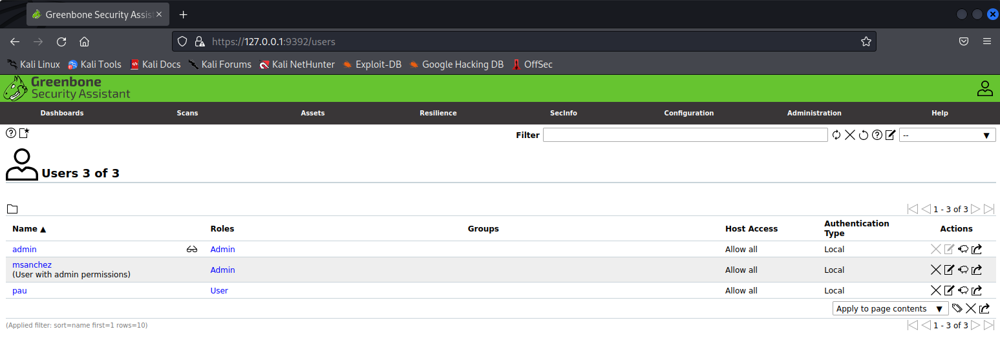
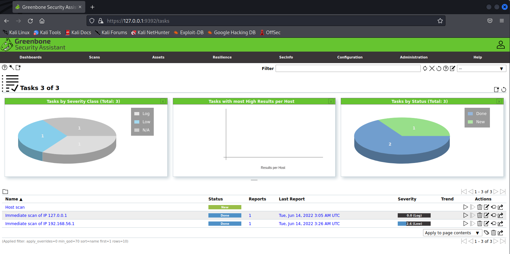
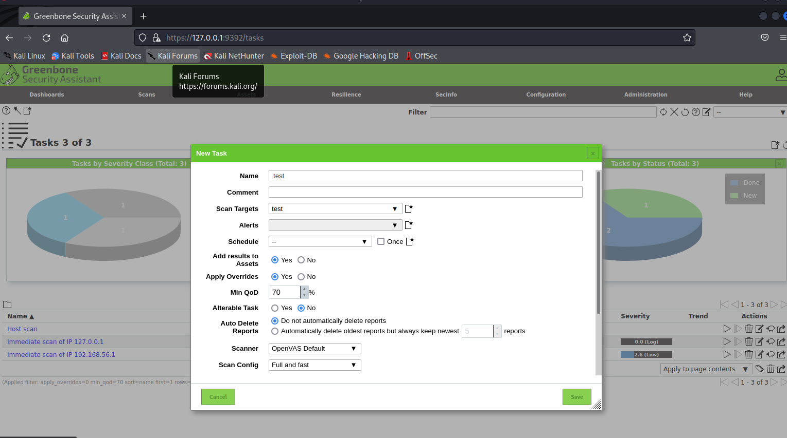
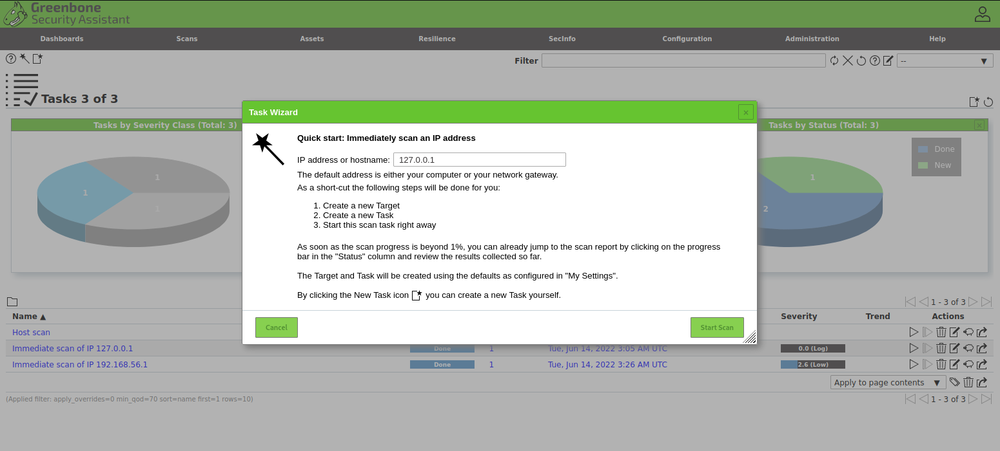

# OpenVAS

## Índex
<ul>
  <li>1. Què és OpenVAS?</li>
  <li>2. Selecció de distribució linux</li>
  <li>3. Preparació entorn virtual</li>
  <li>4. Set up OpenVAS</li>
  <li>5. Algunes funcions del Web UI</li>
  <li>6. Possibles errors durant la instal·lació</li>
  <li>7. Conclusió</li>
</ul>

## 1. Què és OpenVAS?

## 2. Selecció de distribució linux
A l'hora de fer una instal·lació, cal decidir quin sistema operatiu/distribució és el més adient per diferents motius, ja sigui per:
 <ul>
  <li> Facilitar procès instal·lació</li>
  <li> Millorar rendiment</li>
  <li> Seguretat de l'entorn</li>
  <li> etc.</li>
</ul>
En aquest cas, es va arrencar amb la idea d'instal·lar el servei OpenVAS dins d'un Ubuntu 20.04.
Després de realitzar unes cerques i fer alguna que altra prova, instal·lar el servei en Ubuntu no es va considerar adequat. Ubuntu no compta amb els repositoris necessaris per la instal·lació d'OpenVAS, a més, que constava d'una instal·lació tediosa i més llarga que en altres casos.   
Per aquest motiu, seguint la recomanació d'usuaris a Internet, s'ha decidit a instalar-ho dins d'un Kali Linux 2022.2 (Repositoris OpenVAS inclosos, set up automàtic).  

/> 

## 3. Preparació entorn virtual
S'utilitzarà l'eina Virtualbox per arrencar el Kali Linux 2022.2.
 
Primerament, cal baixar la ISO per a màquines virtuals de Kalo, especialment la que està feta per a Virtualbox.
 

 
Un cop descarregada, arrenquem Virtualbox desde terminal.
~~~
# virtualbox
~~~
Un cop dins fem un import seleccionant la imatge prèviament descarregada.
 

 
Arrenquem la màquina virtual i procedim amb la instal·lació del sistema.

### Configuracions a tenir en compte per a la màquina virtual:
1. Cal activar dos adaptadors de xarxa, un de NAT per a que la màquina virtual tingui sortida a Internet, i un de Host-only per a que el nostre host sigui a la mateixa xarxa que la màquina virtual.
Aquestes configuracions es fan desde settings de Virtualbox, Networking.
2. Dins de la màquina virtual cal editar el fitxer /etc/network/interfaces per a que la maquina desde dins pugui tenir connectades alhora els dos adaptadors de xarxa. Cal afegir les següents línies:
~~~
auto eth0
iface eth0 inet dhcp

auto eth1
iface eth1 inet dhcp
~~~
Fem un reboot i ja tindrem tot llest per a dur el següent pas, la instal·lació de OpenVAS.
 
## 4. Set up OpenVAS
Obrim el terminal de Kali i comencem per actualitzar repositoris:
~~~
# apt-get update && apt-get install
~~~
Instal·lem el paquet OpenVAS:
~~~
# apt-get install openvas
~~~
Creació del set up d'OpenVAS automàtic, aquest és un procès lent i que encara sembli que ha acabat, en background continua fent coses, per tant cal donar-li bastant temps.
~~~
# gvm-setup
~~~
Un cop finalitzat el set up, cal estar atents, ja que a les ultimes línies d'execució, ens avisa de que s'ha creat un usuari admin amb una contraseña autogenerada. Es molt recomanable guardar aquestes crendencial a un fitxer, per més endavant.

Comprovació de que el set up ha funcionat bé "aparentment":
~~~
gvm-check-setup
~~~
D'aqui en endavant es interesant realitzar la següent comanda, pero tenir imprès per stdout els logs del servei al moment:
~~~
tail -f /var/log/gvm/gvmd.log
~~~
Configuració per defecte, per a rebre les dades tipus GVMD_DATA:
~~~
greenbone-feed-sync --type GVMD_DATA
~~~
Configuració per defecte, per rebre les dades tipus SCAP:
~~~
greenbone-feed-sync --type SCAP
~~~
Configuració per defect, per rebre les dades tipus CERT:
~~~
greenbone-feed-sync --type CERT
~~~
Podem comprovar que estem rebent aquestes dades amb la comanda:
~~~
htop
~~~
Arrencar OpenVAS service:
~~~
gvm-start
~~~
Per defecte, sens obrirà el navegador carregant la Web UI d'OpenVAS amb la url http://127.0.0.1:9392
Segurament no podem accedir, es normal, el servei triga molta estona en estar llest.
En tot cas, podem rebotar el servei.
~~~
gvm-stop
gvm-start
~~~
Un cop dins fem login amb les credencials de l'usuari admin que tenim guardades.

Ja ho tenim tot llest per poder fer escàners.

## 5. Algunes funcions del Web UI
Com es pot apreciar, la interficie d'usuari d'OpenVAS és bastant intuitiva.
Algunes coses que potser ens interesen veure poden ser les següents:
### · Gestió d'usuaris, grups i permisos:
 

 

Des d'aquí podem crear usuaris, grups i donar permisos de manera intuitiva.
### · Arrencar escanejos
  

 
Tenim diverses formes d'arrencar un escaneig, aqui en mostraré dues:
 
· La primera és anar a la pestanya scans/tasks/new task.
Afegim nom identificatiu al scan creat, afegim un target que es on especificarem a quin host volem fer l'escaner i a scanner selecciones el d'OpenVAS per defecte.
  

 
Cliquem save i tard o d'hora comensarà l'escaneig. Com tot el que està relacionat amb OpenVAS, triga molt de temps. 
· La segona manera de crear un scan és dins scans/tasks/task wizard que realitzarà automaticament els pasos del punt anterior, crear task, crear target, arrencar escaneig automàticament. Només li haurem d'indicar el host al qual fer l'escaner.
  

 
### · Veure resultats
Dins d'aquesta mateixa pestanya, podem veure els reports, results i vulnerabilities dels escanejos realitzats.
