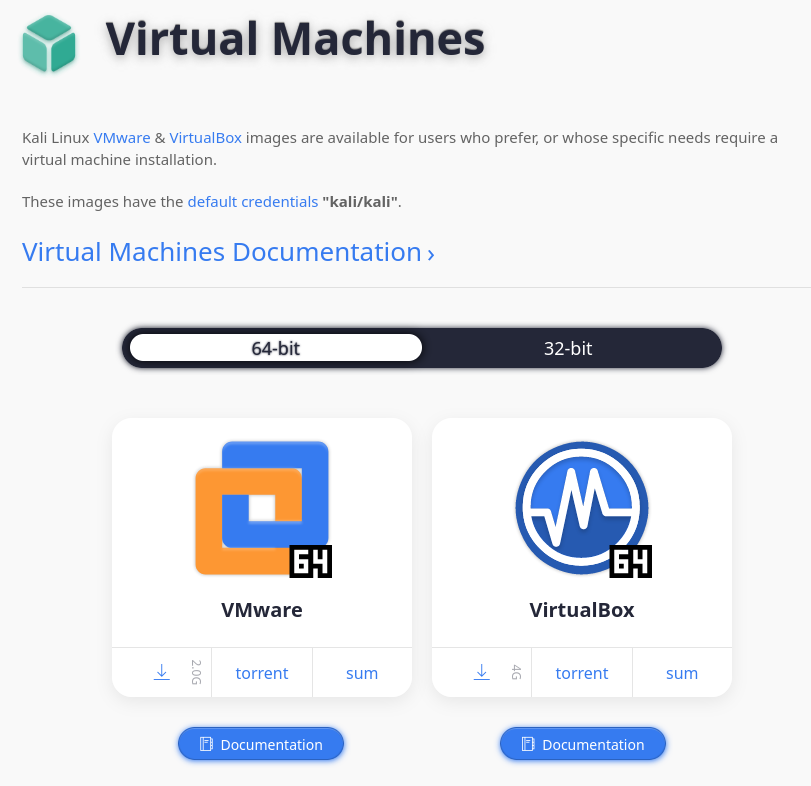
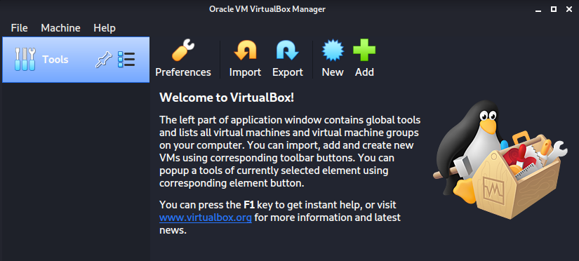

# OpenVAS

## Índex
<ul>
  <li>1. Què és OpenVAS?</li>
  <li>2. Selecció de distribució linux</li>
  <li>3. Preparació entorn virtual</li>
  <li>4. Set up OpenVAS a l'entorn virtual</li>
  <li>6. Algunes funcions del Web UI</li>
  <li>7. Possibles errors durant la instal·lació</li>
  <li>8. Conclusió</li>
</ul>

## 1. Què és OpenVAS?

## 2. Selecció de distribució linux
A l'hora de fer una instal·lació, cal decidir quin sistema operatiu/distribució és el més adient per diferents motius, ja sigui per:
 <ul>
  <li> Facilitar procès instal·lació</li>
  <li> Millorar rendiment</li>
  <li> Seguretat de l'entorn</li>
  <li> etc.</li>
</ul>
En aquest cas, es va arrencar amb la idea d'instal·lar el servei OpenVAS dins d'un Ubuntu 20.04.
Després de realitzar unes cerques i fer alguna que altra prova, instal·lar el servei en Ubuntu no es va considerar adequat. Ubuntu no compta amb els repositoris necessaris per la instal·lació d'OpenVAS, a més, que constava d'una instal·lació tediosa i més llarga que en altres casos.   
Per aquest motiu, seguint la recomanació d'usuaris a Internet, s'ha decidit a instalar-ho dins d'un Kali Linux 2022.2 (Repositoris OpenVAS inclosos, set up automàtic).  

/> 

## 3. Preparació entorn virtual
S'utilitzarà l'eina Virtualbox per arrencar el Kali Linux 2022.2.
 
Primerament, cal baixar la ISO per a màquines virtuals de Kalo, especialment la que està feta per a Virtualbox.
 

 
Un cop descarregada, arrenquem Virtualbox desde terminal.
~~~
# virtualbox
~~~
Un cop dins fem un import seleccionant la imatge prèviament descarregada.
 

 
Arrenquem la màquina virtual i procedim amb la instal·lació del sistema.
